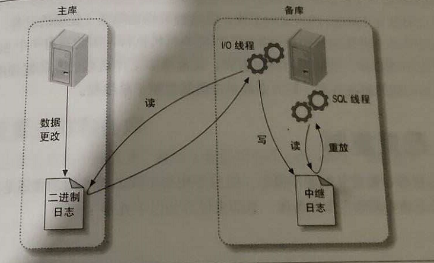

# mysql事务隔离级别

## READ UNCOMMITTED 读未提交

该隔离级别的事务会读到其它未提交事务的数据，此现象也称之为脏读。

## READ COMMITTED 读已提交

一个事务可以读取另一个已提交的事务，多次读取会造成不一样的结果，
，Oracle 和 SQL Server 的默认隔离级别。

## REPEATABLE READ 可重复读

该隔离级别是 MySQL 默认的隔离级别，在同一个事务里，select 的结果是事务开始时时间点的状态，因此，同样的 select 操作读到的结果
会是一致的，但是，会有幻读现象。MySQL 的 InnoDB 引擎可以通过 next-key locks 机制（参考下文"行锁的算法"一节）来避免幻读。

## SERIALIZABLI 序列化

在该隔离级别下事务都是串行顺序执行的，MySQL 数据库的 InnoDB 引擎会给读操作隐式加一把读共享锁，从而避免了脏读、不可重读复读和幻读问题。


# 索引
在MySQL中，索引分为两大类：聚簇索引和非聚簇索引。聚簇索引是按照数据存放的物理位置为顺序的，而非聚簇索引则不同；
聚簇索引能够提高多行检索的速度，而非聚簇索引则对单行的检索速度很快。
在这两大类的索引类型下，还可以将索引分成四个小类：

- 1、普通索引：最基本的索引，没有任何限制，是我们大多数情况下使用到的索引。

- 2、唯一索引：与普通索引类型，不同的是唯一索引的列值必须唯一，但允许为空值。

- 3、全文索引：全文索引（FULLTEXT）仅可以适用于MyISAM引擎的数据表；作用于CHAR、VARCHAR、TEXT数据类型的列。

- 4、组合索引：将几个列作为一条索引进行检索，使用最左匹配原则。
##建立索引的原则
```text
1，最左前缀匹配原则。
2，等于（=）和in 可以乱序。
3，尽量选择区分度高的列作为索引，区分度的公式是 COUNT(DISTINCT col) / COUNT(*)。
4，索引列不能参与计算，尽量保持列“干净”
5，尽可能的扩展索引，不要新建立索引。
6，单个多列组合索引和多个单列索引的检索查询效果不同，因为在执行SQL时，MySQL只能使用一个索引，
   会从多个单列索引中选择一个限制最为严格的索引。
```

## MySql复制

### MySQL一主多从复制过程

- 1、在主库上把数据更改记录到二进制文件（Binary Log）中（这些记录被称为二进制日志事件）
- 2、备库将主库上的日志复制到自己的中继日志（Relay Log）中
- 3、备库读取中继日志中的事件，将其重放到备库数据上

### 复制详细过程



- 第一步是在主库上记录二进制日志。在每次准备提交事务完成数据更新前，主库将数据更新记录到二进制日志中。MySQL会按照事务提交的顺序而非每条语句的执行顺序来记录二进制日。
在记录二进制日志后，主库会告诉存储引擎可以提交事务了。

- 下一步，备库将主库的二进制日志复制到本地的中继日志中。首先，备库会启动一个工作线程，称为I/O线程，I/O线程跟主库建立一个普通的客户端连接，然后在主库上启动一个特殊的
二进制转储（binglog dump）线程，在这个二进制转储线程会读取主库上的二进制日志中的事件。它不会对事件进行轮询。如果该线程追赶上了主库，它将进入睡眠状态，直到主库发送
信号量通知其有新的事件产生时才会被唤醒，备库I/O线程会将接收到的事件记录到中继日志中。

- 备库的SQL线程执行最后一步，该线程从中继日志中读取事件并在备库执行，从而实现备库数据的更新。当sql线程追赶上I/O线程时，中继日志通常已经在系统缓存中，所以中继日志的
开销很低。sql线程执行的事件也可以通过配置选项来决定是否写入其自己的二进制日志中，它对于我们稍后提到的场景非常有用。

### MySQL复制配置

- 1、在每台服务器上创建复制账号
- 2、配置主库和备库
- 3、通知备库连接到主库并从主库复制数据


### mysql 修改权限

```shell script
 use mysql;
 update user set host = '%' where user = 'root';
 update user set host = '%' where user = 'goobai';
 GRANT REPLICATION SLAVE, REPLICATION CLIENT ON *.* TO 'goobai'@'%';
 FLUSH   PRIVILEGES;

select host, user, authentication_string, plugin from mysql.user;

ALTER USER 'goobai'@'%' IDENTIFIED WITH mysql_native_password BY 'goobai777';

FLUSH PRIVILEGES;

CREATE USER 'goobai'@'%' IDENTIFIED BY 'goobai777'

ALTER USER 'mysql'@'%' IDENTIFIED WITH mysql_native_password BY 'Goobai!1';

show grants for mysql

SHOW VARIABLES LIKE 'validate_password%';

set global validate_password_policy=0;

set global validate_password_length=4;

FLUSH PRIVILEGES;

SHOW SLAVE STATUS
RESET SLAVE

change master to master_host='192.168.1.199', master_user='goobai', master_password='goobai777', master_port=3306, master_log_file='mysql-bin.000003', master_log_pos=939, master_connect_retry=30,get_master_public_key=1;
START SLAVE
stop SLAVE
```

### mysql重置密码
```shell script
#编辑mysql配置文件
vim /etc/my.cnf

#添加
skip-grant-tables
#重启mysql
systemctl restart mysqld.service 

#连接mysql，直接回车即可，不需要输入密码
mysql -u root -p

#更新root用户密码
update mysql.user set authentication_string='password'  where user='root' and Host = 'localhost';
ALTER USER 'root'@'localhost' IDENTIFIED WITH mysql_native_password BY 'Goobai!1';
#刷新权限
flush privileges;

#退出mysql
exit
```
### 
```shell script
lower_case_table_names=0 表名存储为给定的大小和比较是区分大小写的
lower_case_table_names = 1 表名存储在磁盘是小写的，但是比较的时候是不区分大小写
lower_case_table_names=2 表名存储为给定的大小写但是比较的时候是小写的
```