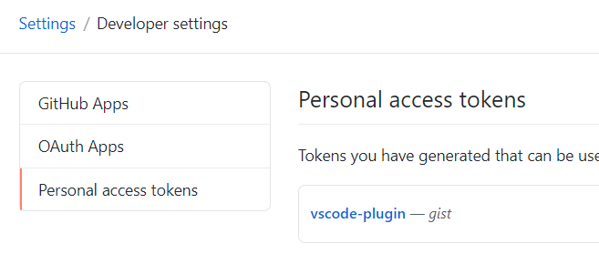

# vscode同步插件

## vscode安装插件Settings Sync

## github在setting->develop setting->Personal access tokens 中生成accesstoken(注意勾选gist)

## vscode中使用快捷键shift+alt+u 输入accesstoken，记录gist id

## vscode中使用快捷键shift+alt+d 输入accesstoken、gist id等待同步设置完成
